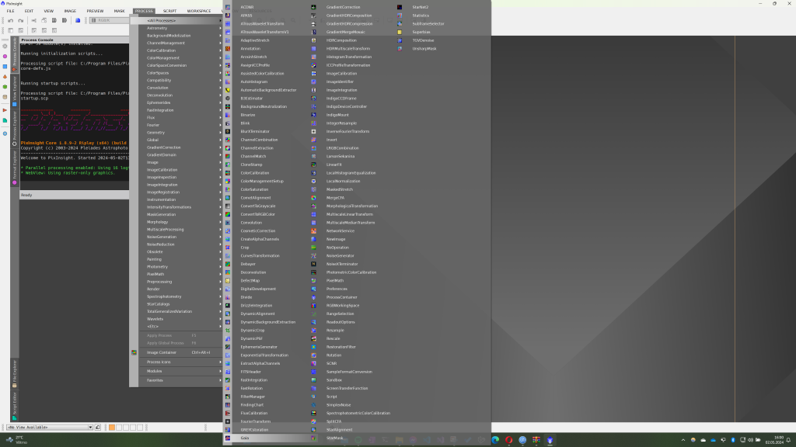
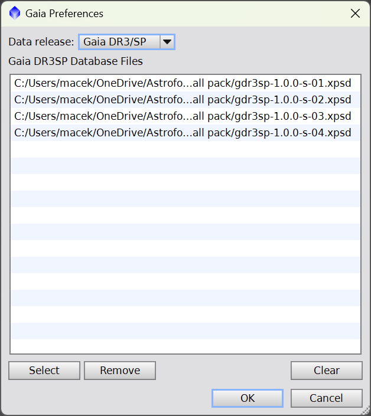

*Cílem této série návodů je provést začátečníka zpracováním DSO fotografií v programu PixInsight. Neočekává se od vás žádná znalost prostředí programu, ale zároveň by čtenář měl mít už nějaké povědomí o kalibračních snímcích, principu „stackování apod. Mým cílem je ukázat, že hezký (nikoliv dokonalý) snímek lze zpracovat v pár krocích s maximálním využitím toho, co PixInsight a různé jeho doplňky nabízí. Ukázková data (M42 – light frames, kalibrační snímky a nastackovaný snímek), která budou tuto sérii provázet jsou k dispozici ke stažení [zde](https://mega.nz/file/TYJXFIrJ#G6RTYuLBZxfHNJGWx-znRU1B8f1oh1rEwyQ8NnqSr4k).

## Stažení a instalace PixInsight

PixInsight je placený software určený výhradně pro zpracování astrofotografických dat. Pokud ho nemáte koupený, nevadí, jeho autoři nabízí bezplatné zkušební období 45 dní, ke kterému se můžete přihlásit [zde](https://pixinsight.com/trial/). Jen upozorním, že se nelze zaregistrovat e-mailem na doménách Microsoftu (Hotmail, Outlook, Live…). Vývojáři s ověřováním emailů na těchto doménách měli nejspíše nějaké problémy a zablokovali je. Žádost o trial je schvalována ručně, může to tedy několik pracovních dní trvat. O úspěšném vyřízení žádosti budete informování e-mailem. Jediné omezení trial verze je, že je potřeba mít pro spuštění programu funkční internetové připojení, aby se zamezilo pokusům o „nekonečné prodlužování trialu“ 🙂  
  
Ať už jste úspěšně obdrželi trial licenci nebo máte PixInsight koupený stáhnout ho lze přímo na stránkách prodejce [zde](https://pixinsight.com/dist/browser.php). 

Instalace je velmi jednoduchá, není potřeba žádné nastavení měnit, zkrátka proklikat a počkat až se software nainstaluje. 

## První spuštění

Po prvním puštění vás PixInsight vyzve k aktivaci licence, ať už po zakoupení či po obdržení trial licence, aktivační klíč najdete v emailu. Stačí ho spolu s uživatelským jménem zvoleným při registraci vyplnit a je hotovo. 

Instalaci máme hotovou, nyní se vrhneme na instalaci užitečných doplňků. 

## StarNet2

StarNet2 je program pro odstranění hvězd z obrázku za pomoci strojového učení. Funguje bezvadně, je celkem rychlý a je zdarma. Jedná se o software třetí strany, který je dostupný jako samostatný program a nebo modul do PixInsightu, ten zajímá nás. Máte-li pocit, že nic takového rozhodně nepotřebujete, nechcete nikde prezentovat trapné snímky mlhovin bez hvězd, tak věřte že pro určitou fázi zpracování snímku je možnost (dočasně) odstranit hvězdy klíčová a nepostradatelná. 

Modul lze stáhnout [zde](https://www.starnetastro.com/download/). Stáhnete .zip archiv, jehož kompletní obsah zkopírujte do „bin“ složky instalace PixInsightu, cesta bude zpravidla vypadat nějak takto C:\Program Files\PixInsight\bin.

V PixInsightu vybereme záložku Process, dole Modules a Install modules  

V zobrazeném okně zkontrolujeme cestu, zda odpovídá tomu, kam jsme nakopírovali soubory StarNetu. Klikneme na Search, PixInsight najde nové moduly a poté pouze potvrdíme tlačítkem Install a je hotovo.

## StarNet2 a grafické karty

Máte-li počítač s grafickou kartou Nvidia podporující technologii Cuda, máte vyhráno! Standartně StarNet2 používá výkon procesoru pro odstranění hvězd, když mu ale umožníme využít grafickou kartu, proces může být klidně **10x rychlejší!** Místo dvou minut bude odstranění trvat 10 sekund. Podrobný návod naleznete [zde](https://rikutalvio.blogspot.com/2023/02/pixinsight-cuda.html).

## Instalace skriptů třetích stran

Pro ulehčení zpracování obrázků používám různé dodatečné skripty, které celý proces významně urychlují a zjednodušují. PixInsight je vývojářům otevřen a umožňuje programovat libovolné skripty jako nástavbu nad procesy, které již obsahuje. Nebudu zde nyní jednotlivé skripty a autory rozepisovat, setkáme se s nimi v průběhu dalších dílů. Teď je pouze nainstalujeme. 

Klikneme na záložku Resources => Updates => Manage repositories

Postupně klikneme dvakrát na add a přidáme jednotlivé adresy:  
https://elveteek.ch/pixinsight-updates/ez-processing-suite/  
https://www.ideviceapps.de/PixInsight/Utilities/

Potvrdíme tlačítkem OK, znovu otevřeme záložku Resources => Updates a nyní klikneme na Check for updates. Výsledek odklikneme, zavřeme okno PixInsightu, ten se po zavření zeptá, zda může nainstalovat aktualizace, což mu povolíme a je opět hotovo.   
Spolu s balíkem skriptů se nainstaloval i script pro GraXpert, což (opět neplacený) program na odstraňování gradientů z pozadí obrázků, aby skript fungoval, je potřeba nainstalovat GraXpert z těchto stránek <https://www.graxpert.com>.   
Po instalaci v PixInsightu otevřeme záložku Scripts => Toolbox => GraXpert, klikneme na tlačítko nastavení a PixInsight buď vyhledá cestu, kde je GraXpert nainstalovaný sám a nebo mu ji zadáme.   

## Gaia (volitelné)

Gaia je obrovský katalog – databáze hvězd, který vytvořila Evropská kosmická agentura (ESA) v rámci mise Gaia. Jedná se o modul integrovaný přímo v PixInsight a pro jeho funkčnost je potřeba stáhnout databázi Gaia. To lze provést přímo ze stránek PixInsight na záložce [Software distribution](https://pixinsight.com/dist/browser.php). Katalog není nezbytné mít stažený v počítači, ale umožní nám to využívat funkce jako Image Solver i bez internetového připojení. Pokud máte ale málo místa na disku, málo času či jinou výmluvu, lze Gaiu přeskočit. 

Pro naše potřeby bude rozhodně stačit „small set“, který obsahuje pouze 4 soubory v celkové velikosti něco přes 10GB. Stáhněte si je do libovolné složky, kde je budete dlouhodobě uchovávat. 

Nyní přejdeme do PixInsightu a otevřeme proces Gaia

V procesu v pravém dolním rohu klikneme do nastavení a přidáme stažené Gaia soubory.   

Poté klikneme na ok a zkontrolujeme, že Data release kolonka je nastavena na Gaia DR3/SP.

Na závěr stačí kliknout na modré kolečko v levém holním rohu. V konzoli problikne zpracování Gaia databáze a vše by tímto mělo být hotové. 

## NoiseXterminator & BlurXterminator (volitelné)

Jedná se opět o moduly třetích stran a ještě k tomu placené. Nicméně mají 30-denní zkušební období zdarma a lze je využít i ve zkušební verzi PixInsightu. Za vyzkoušení rozhodně stojí. 

Oba moduly používají strojové učení, jeden pro eliminaci šumu a druhý pro „zostření“ obrázku. BlurXterminator může zdánlivě nepoužitelná data (např. z důvodu horší kolimace, ostření apod.) zachránit v relativně hezký snímek. Postup instalace je podobný jako při instalaci skriptů výše, jen je potřeba si aktivovat trial licenci. Podrobný návod naleznete na stránkách výrobce [zde](https://www.rc-astro.com/pixinsight-installation-instructions/).

  
A máme hotovo! Všechny potřebné doplňky máme nainstalované a můžeme se vrhnout na zpracování.
