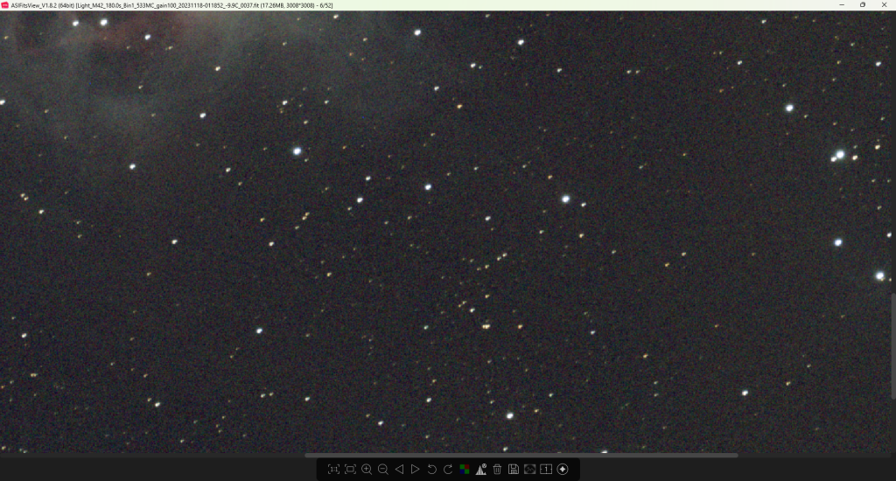
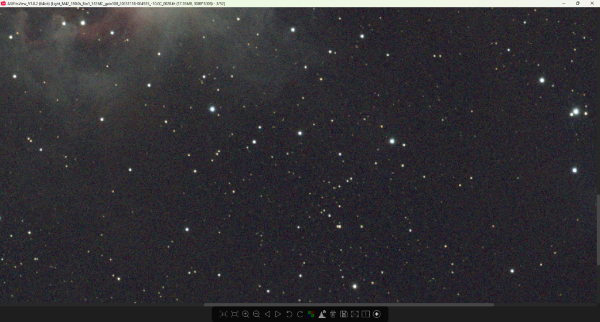

Data ke stažení [zde](https://mega.nz/file/TYJXFIrJ#G6RTYuLBZxfHNJGWx-znRU1B8f1oh1rEwyQ8NnqSr4k). Postupy zde uvedené se budou mírně lišit pro jiné druhy objektů, ale základ je stejný. Data si extrahujte do libovolné složky, odteď s nimi budeme pracovat. 

## Kontrola snímků

Pokud jste tak již neučinili, je vhodné Light framy (snímky objektu) před stackováním projít a vyřadit ty „nepovedené“, to můžou být snímky neostré, kvůli nepřesnosti montáže/guidingu a nebo pokud nám třeba přímo přes objekt přeletělo letadlo. Satelity a letadlo někde na okraji nevadí. Máte-li nějaký vlastní software pro kontrolu a rychlé mazání snímků, používejte to na co jste zvyklí, já ukážu jednu možnost přímo v PixInsightu a pak druhou v podobně neplaceného programu od firmy ZWO. 

## Blink

V PixInsightu lze celou sekvenci projít modulem Blink. 

Po otevření okna Blinku stačí kliknout na malou ikonu složky a načíst ze složky všechny Light snímky. Jedná se o první drobnou zkoušku vašeho počítače, jelikož PixInsight všechny snímky načte rovnou do paměti.   
Po načtení si okno dle potřeby zvětšíme a klikneme na ikonu Play, v okně nám začnou postupně probíhat všechny snímky (rychlost lze nastavit) a hned poznáme, zda nějaký vypadá úplně „divně“. Dle potřeby odstraníme. 

Po ukončení práce s blinkem nezapomeňte kliknout na Close all images, jinak se snímky neodstraní z paměti počítače, dokud celý program nezavřete.   

## ASIFitsViewer

Výbornou alternativou pro procházení FIT souborů je program od společnosti ZWO, který je zdarma. Je součástí balíku ASIStudio a můžete si ho stáhnout [zde](https://sourceforge.net/projects/asistudio/). Pokud vaše data nejsou ve formátu .fit, možná je ASIFitsViewer nebude umět zobrazit, PixInsight pravděpodobně ano. Pokud ne, použijte program na který jste zvyklí.

S veškerými stopami od satelitů si PixInsight hravě poradí, snímky které chceme stackovat by měly být ostré, neměly by se příliš lišit jasností (první fotky focené hned po západu případně těsně před východem slunce už možná chcete vynechat, je-li rozdíl v jasu pozadí na první pohled patrný). Nejlepším vodítkem, je „kulatost“ hvězd, nejedná-li se o optickou vadu vaší sestavy, hvězdy by zkrátka měly být co nejvíce kulaté a napříč snímky stejně velké. Náhlé „halo“ okolo hvězdy naznačuje vysokou oblačnost co zrovna přecházela, či orosení optiky, takové snímky taky nechceme. Doporučuju si zazoomovat na nějakou skupinu hvězd ve středu obrázku a tu sledovat a porovnávat napříč všemi snímky. 

Že se objekt v průběhu sekvence mírně „pohybuje“, tedy není ve snímcích vždy na stejném místě není nutně na závadu, pokud se jedná o pohyby v řádech jednotek až desítek pixelů. V mém případě je to důsledek ditheringu, tedy cílený žádoucí stav. Může to ale být způsobeno i nepřesností montáže příp. focení na stativu, kdy nám objekt bude v důsledku rotace Země „ujíždět“ určitě. Pokud by ale (z jakéhokoliv důvodu) nějaký snímek byl výrazně posunutý oproti ostatním, je nutné ho odstranit. To neplatí pro stav, kdy je část snímků o 180° otočená oproti ostatním, to je důsledek toho, že objekt přešel přes meridian a museli jsme provést „meridian flip“. S takovým rozdílem si stackovací programy bez problémů poradí. 

## Špatný snímek

## OK snímek

Jak moc budete na Vaše snímky přísní záleží taky na tom, kolik jich máte. V našem případě, kdy máme cca 2,5h dat, chceme opravdu vyhodit jen pár těch nejhorších, a drobné nedostatky guidingu, nepřesnosti montáže apod. raději odpustit a snímky nechat. PixInsight při stackování snímky taky zkoumá a když mu tam necháme nějaký opravdu špatný, pravděpodobně ho sám vynechá. 

> 
> ***ÚKOL:*** *Ať už používáte má nebo vlastní data, nyní je čas na to si snímky projít, promazat a utřídit do složek dle druhu (light, dark, flat…). V příštím článku se už pustíme do stackování.* 
> 
> 
>
