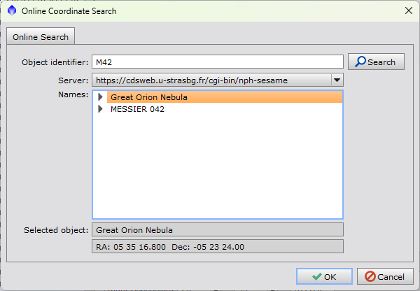
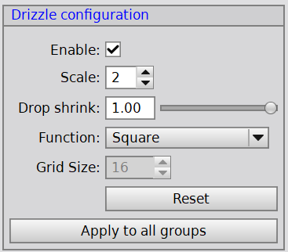
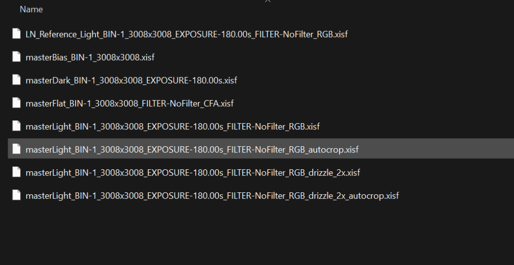

Snímky máme protříděné, ve čtyřech složkách: Light, Dark, Flat, Bias. Pokud nefotíte Bias snímky, ale DarkFlaty, složku si pojmenujte třeba DarkFlat. Nastal čas otevřít PixInsight, v něm záložku Scripts => Batch Processing => WeightedBatchPreProcessing, což je kryptický název pro skript, který umí mimo jiné i stackovat snímky :-).

Máte-li data hezky rozřazena ve složkách dle druhu snímku, můžete vyzkoušet rovnou kliknout v levém dolním rohu okna tlačítko + Directory a vybrat složku s daty. **Je důležité, aby ve složce byla opravdu jen data rozřazená do složek, žádné další soubory!** Pozná-li skript správně všechny snímky, výsledek by měl na záložce calibration vypadat nějak takto:

Pokud se nezdařilo a snímky nejsou správně rozpoznané, vyresetujte soubory tlačítkem reset na spodku okna a využijte pro přidání snímků jednotlivá tlačítka +Bias, +Darks, +Flats, +Lights. Pokud nemáte Bias snímky, ale dark flaty, přidejte je jako darky, skript si je přiřadí správně díky shodně dlouhé expozici s flaty.

V záložkách Bias, Darks a Flats pravděpodobně nic měnit nemusíme, přejdeme rovnou na záložku Lights.

## Lights

Zkontrolujte, že máte na pravé straně okna zakliknuté všechny procesy stejně jako já, od Subframe Weighting až po Image Integration. 

**Astrometric solution**

V sekci Astrometric Solution klikneme na Image Solver parameters… a zkontrolujeme zda jsou pole správně vyplněná. PixInsight při průběhu stackování analyzuje snímky a provádí „plate solving“, potřebujeme mít správně vyplněné souřadnice objektu, ohniskovou vzdálenost dalekohledu, velikost pixelů snímače a datum (čas nemusí být přesný). Pokud používáte jakýkoliv specializovaný software pro focení DSO (ASIAir, KStars, N.I.N.A…), budou tyhle informace obsaženy v TIF hlavičkách Light snímků, přesto je ale zkontrolujte a případně opravte, často se stává, že si PixInsight pamatuje data z posledního stackování, která ale těm současným neodpovídají. Pokud se plate solve během stackování nezdaří, PixInsight vás v průběhu vyzve k zadání těchto informací znovu. 

Souřadnice objektu můžete vyhledat pomocí tlačítka Search, do okna, co se otevře, zadáte název (kód objektu) a PixInsight si souřadnice najde v online katalogu. 

Takto bude vypadat finální zadání pro naše data mlhoviny M42.

**Image Integration**

V Image Integration chceme jen zakliknout Large-scale pixel rejection, sami vývojáři to doporučují od doby, co po obloze létají hromady Starlinků apod. Výsledek bude lepší odstranění stop satelitů a letadel ve složeném snímku.

## Calibration

Nyní přejdeme na záložku Calibration.

Zde v ideálním případě nebude nutné nic měnit. Máme zde shrnuté všechny typy snímků, co jsme načetli do skriput. Zkontrolujte, že vše sedí. u Light snímků na panelu vpravo zkontrolujte, zda je zaškrnuto CFA images pokud jsou vaše snímky barevné. Pokud nejsou, naopak CFA nesmí být zaškrnuto.   
Jestli jste vložili barevné Light snímky a musíte CFA images zaškrtnout ručně, vyberte raději ručně i Mosaic pattern, dle druhu Bayerovy masky vaší kamery. 

Pokud PixInsight nerozpoznal barevný obrázek, pravděpodobně by správně neurčil ani Bayerovu masku. S tímto problémem jsem se už setkal u dat focených přes kamery Moravian Instruments.   
  
**Output directory**  
Rovnou můžeme vybrat „Output directory“ tedy složku, do které bude WBPP skript ukládat průběžná data a výsledný složený snímek. Vyberte složku dle vašich preferencí, ale rozdílnou od složky, kde máte uložena data co zpracováváme. 

## Post-Calibration

Poslední záložka, kterou navštívíme obsahuje tabulku s výslednými snímky. V našem případě zde bude jeden, nicméně existují situace, kdy jich bude více – například budeme chtít zvlášť skládat jednotlivé barevy u mono kamery apod. K tomu by již byly zapotřebí Grouping keywords, o kterých třeba napíšu něco v budoucnu, teď to není důležité.

Zaklikneme jediný řádek v tabulce a nyní se podíváme na možnosti pravého panelu zde. 

**Drizzle**

Pro spoustu z nás bude „drizzling“ opravdu klíčový, abychom ze snímků vytěžili maximum detailů.   
Princip fungování spočívá ve využití více snímků stejného objektu s mírným posunem, což umožňuje interpolaci a rekonstrukci detailů, které by jinak nebyly viditelné kvůli omezenému rozlišení jednotlivých snímků.  
Při použití Drizzle algoritmu se jednotlivé snímky „přemapují“ na vyšší rozlišení a kombinují se, což vede k zlepšení ostrosti a snížení šumu.   
Asi je vám ale jasné, že to má nějaký háček a zdaleka to nebude fungovat všude. Pojďme si tedy odpovědět, zda pro vás drizzle bude přínosný:

- **Používáte dithering?** Dithering je technika náhodného posouvání snímků mezi jednotlivými expozicemi, která pomáhá snížit šum a odstranění artefaktů v astrofotografii. Pokud jste při focení použili autoguiding a měli jste zapnutý dithering, máte tento bod splněný. V opačném případě nelze drizzle využít. Alternativou ditheringu by mohlo být, pokud by vám montáž v průběhu celého focení „ujížděla“ a snímky byly k sobě navzájem viditelně posouvané 🙂
- **Máte aspoň 20 Light snímků?** S menším počtem vývojáři PixInsightu nedoporučují drizzle používat.
- **Jsou vaše snímky „under-sampled“?** Under-sampling v astrofotografii nastává, když velikost pixelů kamery je v poměru k ohniskové vzdálenosti dalekohledu a seeingu příliš velká na to, aby zachytila jemné detaily objektu, což vede k jejich ztrátě a zhoršení kvality obrazu. Spočítat si to můžete [zde](https://astronomy.tools/calculators/ccd_suitability "zde"). Vývojáři PixInsightu sice říkají, že byste i v případě odpovídající velikosti pixelu měli použít drizzle se Scale 1 (pouze s barevnou kamerou a velkým počtem Light snímků), já jsem při svých pokusech nezaznamenal žádný benefit.
- ***Máte cca dvojnásobek času na proces stackování?*** Drizzle způsobí že celý běh WBPP skriptu je z mé zkušenosti skoro 2x tak dlouhý. Pokud víte, že data nejsou příliš dobrá, chcete si to jen složit a podívat se, nedoporučuji ho zapínat.

Základní nastavení Drizzle můžete vyzkoušet takto:

Scale 2 znamená, že výsledný snímek bude mít 2x menší pixely, vyšší Scale jsem zatím nikdy nepoužil. 

## Spuštění

A máme hotovo! Vše máme nastavené, nezbývá než v pravém dolním rohu kliknout na Run a v klidu počkat na konec procesu 🙂 Doba zpracování se bude extrémně lišit dle množství a velikosti vašich dat a rychlosti vašeho počítače. Může to být něco mezi 15 minutami a mnoho mnoho hodinami. Vzorová data ode mě by na modernějším PC neměly zabrat více než hodinu. Problémy v průběhu stackování nebývají časté. Může se stát, že nezafunguje automatický plate solve (rozpoznání hvězd na snímku) a budete muset ručně opět vybírat souřadnice objektu, datum, čas, ohnisko a velikost pixelů, tak jako jsme to dělali výše v tomto článku v sekci Astrometric solution. 

## Závěr a výsledky

Po ukončení procesu se podíváme do složky, kterou jsme ve WBPP zvolili. Struktura by měla vypadat následovně:  

Primárně nás budou zajímat data ze složky master:

Konkrétně soubor *masterLight\_BIN-1\_3008x3008\_EXPOSURE-180.00s\_FILTER-NoFilter\_RGB\_autocrop.xisf* představuje složený snímek, který byl zároveň ořezán do takové oblasti, kterou mají všechny snímky společnou (např. kvůli ditheringu a ujíždění montáže se pozice objektů napříc jednotlivými snímky mírně liší).   
Dále pak soubor *masterLight\_BIN-1\_3008x3008\_EXPOSURE-180.00s\_FILTER-NoFilter\_RGB\_drizzle\_2x\_autocrop.xisf* je rovněž složený a ořezaný, ale jedná se o soubor, na který byl použit drizzling (bude i o dost větší). Můžete si je vzájemně porovnat, zda uvidíte rozdíl 🙂

Struktura pojmenování je vždy stejná, budou se lišit jen čási o biningu, rozlišení a expozici, tedy i u vašich dat také snadno najdete správný výsledný složený snímek. Můžete si ho zkusit otevřít a v příštím díle se vrhneme na zpracování!
