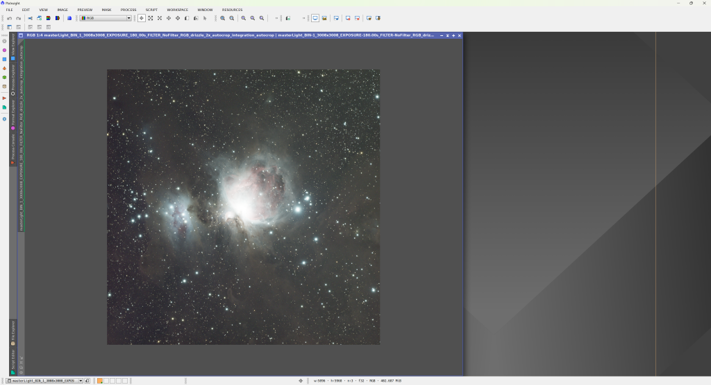
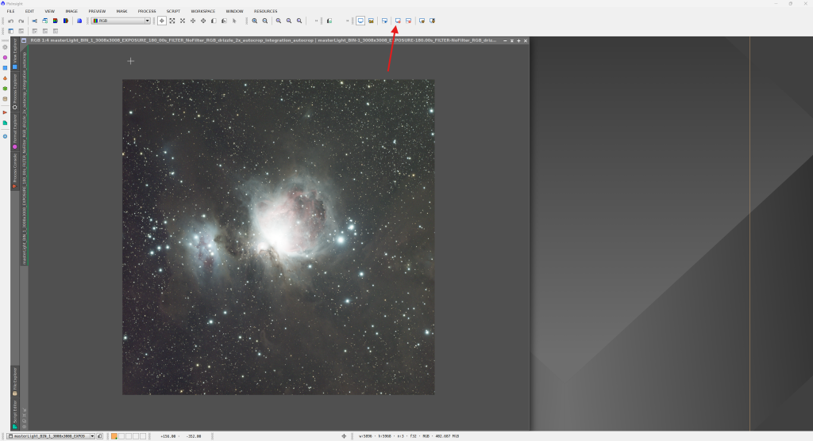
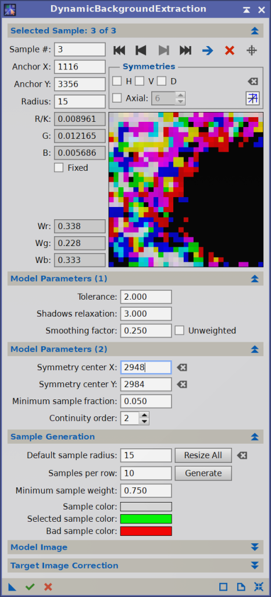
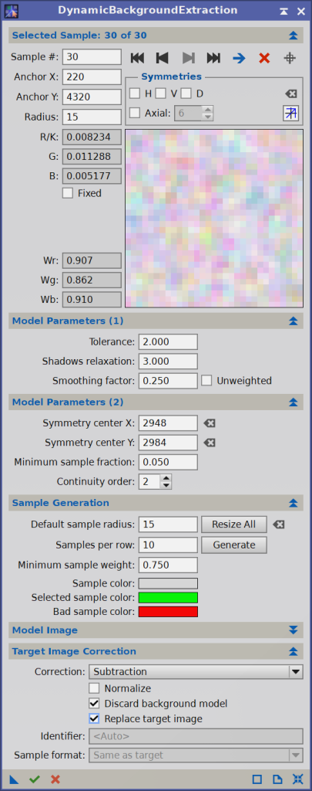
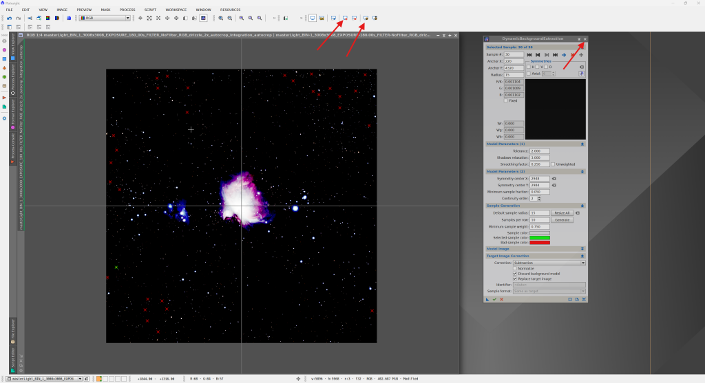
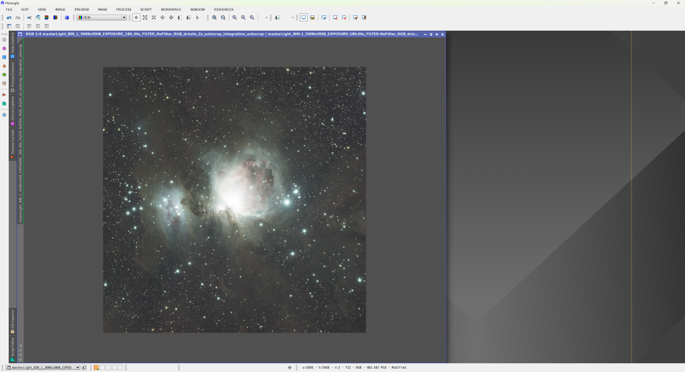
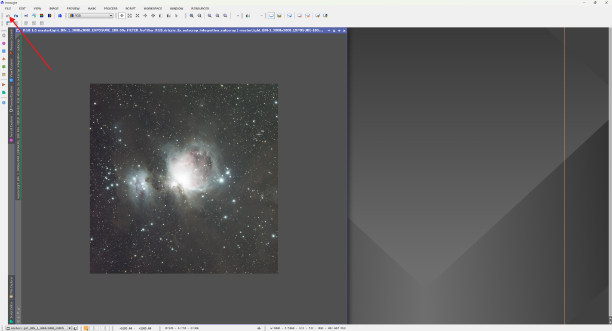
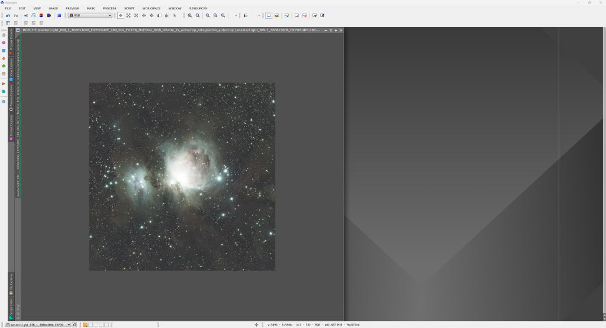

Nyní můžeme konečně otevřít náš složený snímek z minulého dílu. Učiníme tak kliknutím na kartu File => Open. Poté stačí najít adresář kde máme výsledky z WBPP a otevřít soubor *masterLight……xisf,* jak jsme si již řekli na konci [předchozího dílu](https://clearskies.cz/2024/06/24/pixinsight-pro-uplne-zacatecniky-3-stackovani-wbpp/ "PixInsight pro úplné začátečníky #3 – stackování WBPP").   

Otevřou se nám dvě okna, jedno z nich (nejspíše to v popředí) představuje pouze masku na základě které byl proveden autocrop snímku, v názvu okna je „…mask“ to můžeme v klidu zavřít a zbude nám výsledný složený snímek. 

Žádná sláva, že? Nevadí, hned se do toho pustíme. Okno si dle libosti a možností vašeho monitoru přízpůsobte a obrázek přibližte kolečkem myši, tak aby byl co největší. Poté v horní liště klikneme na tlačítko obsahující monitor a znak „radioaktivity“ :). Pokud se náhodou tlačítko u vás na horní liště nevyskytuje, otevřete záložku Process => ScreenTransferFunction a tam ho uvidíte. A hned po kliknutí se začnou dít věci…

PixInsight nám čistě pro účely zobrazení upravil histogram, tak abychom něco viděli. Fyzicky v obrázku nezměnil vůbec nic, data se nijak nezměnila. Funkce má název STF AutoStretch. Obrázek je viditelně velmi zelený, je to dáno tím, že barevné kamery zaznamenávají 2x více zelené než ostatních barev, není to pro nás žádný problém, stačí na tlačítko znovu kliknout se zmáčknutým CTRL a AutoStretch automaticky barevné kanály vyrovná, k původnímu vzhledu se lze vrátit podržením Shift a kliknutím.

Trochu lepší, že? Zrušit AutoStretch lze kliknutím na tlačítko monitoru a křízku o dvě tlačítka vedle od tlačítka AutoStretch. Ještě jednou upozorním, že se opravdu jedná pouze o změnu zobrazení a když bychom teď snímek uložili, bude vypadat jako ten na prvním obrázku – nic tam nebude. 

##### Extrakce pozadí

Hned na první pohled si můžeme povšimnout, že pravá horní část obrázku je viditelně světlejší než její protější spodní levá strana. Jedná se o takzvané gradienty, které může způsobovat cokoliv v dáli svítícího města po sousedovu extrémně otravnou žárovku na fotobuňku. Rozhodně se jich chceme zbavit a k tomu nám dopomohou dva možné moduly. 

###### DynamicBackgroundExtraction

První proces zahrnuje poměrně hodně ruční práce, otevřeme ho ze záložky Process => DynamicBackgroundExtraction. Po otevření okna procesu klikneme kamkoliv do obrázku a trochu upravíme nastavení. Proces funguje tak, že ručně vyklikáme místa v obrázku, kde se nevyskytuje žádná mlhovina ani hvězdy – tedy opravdu pouze pozadí. 

Hodnoty nastavení, které zvýrazňuji se pro vás mohou lišit. Nicméně se jedná o toleranci „nedokonalosti“ pozadí a velikost jednotlivého bodu, berte to jako výchozí bod, ze kterého můžete začít a nastavení upravit dle potřeby. Naším cílem je teď naklikat aspoň 30 bodů co nejvíce rovnoměrně uvnitř obrázku, kde se nachází pouze pozadí, dávejme si prosím pozor na temné mlhoviny o které bychom mohli tímto způsobem přijít. Je důležité se jim vyhnout. 

✔️Ideálně vybraný jeden bod by měl v náhledu okna procesu vypadat zhruba takto

❌Špatně vybraný bod asi takto

Je vidět, že ten špatně vybraný obsahuje v pozadí nějakou mlhovinu a velikou hvězdu v pravé části, opravdu je důležité se takovým vyvarovat. 

Výsledek může vypadat zhruba takto.

Poté v okně DBE (DynamicBackgroundExtraction) rozbalíme sekci Target Image Correction a nastavíme následovně.   

A staší jen kliknout na zelenou faječku ✔️ vlevo dole. S obrázkem se stane cosi divného a je potřeba zrušit a znovu aplikovat AutoStretch. DBE můžeme v tuto chvíli zavřít. 

Můžete si povšimnout, jak se nám pozadí pěkně vyrovnalo. 

Celkem pracné že? Pro většinu případů existuje lehčí cesta. V PixInsightu přímo integrovaný proces AutomaticBackgroundExtractor dle mého názoru neprodukuje příliš dobré výsledky, na mnou preferovaný proces se hned podíváme.

###### GraXpert

Chcete-li, můžete si obrázek vrátit o krok dozadu šipkou na liště vlevo nahoře. Poté zrušit a znovu aplikovat Auto Stretch. 

Pokud jste instalovali všechny doplňky dle postupu v [prvním dílu](https://clearskies.cz/2024/04/29/1-instalace-pixinsight-priprava-prostredi/ "PixInsight pro úplné začátečníky #1 – Instalace PixInsight, příprava prostředí"), můžete nyní kliknout na záložku Scripts => Toolbox => GraXpert. 

Není třeba nic měnit, stačí stisknout zelenou faječku ✔️, pokud dojde k problému zkontrolujte přes tlačítko nastavení vpravo dole, že máte správně nastavenou cestu k instalaci GraXpertu, jiný problém by nastat neměl. 

Výsledek je srovnatelný a zabralo nám to asi tak 5 sekund :). Proč jsem vám tedy ukazoval první způsob pomocí DBE? Primárně proto, abyste pochopili, jak vyrovnání pozadí funguje. Jediný případ, kde by výsledek mohl být mírně odlišný by byl snímek s opravdu velkým množstvím temných mlhovin, tam by se možná vyplatilo použít ruční DBE, jinak se spokojíme s GraXpertem. 

Zbavili jsme se gradientů a v dalším dílu se můžeme vrhnout na kalibraci barev. Pokud vám cokoliv není jasné, zkuste si celý postup projít ještě jednou, zkontrolovat zda máte vše správně nainstalováno a v případě přetrvávajících problémů se mi klidně ozvěte dole v komentářích :). 

Dobrá práce!
