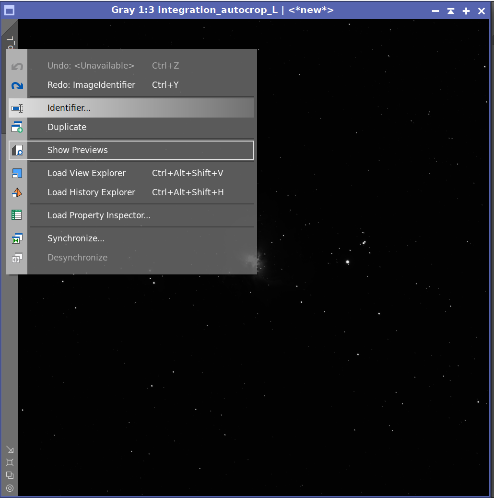
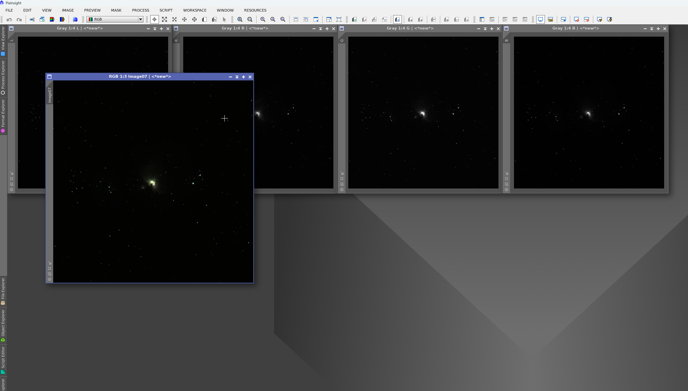

> **Tato lekce je volitelná a určena pouze pro uživatele mono kamer.**  
> Pokud používáte barevnou kameru (OSC), můžete ji přeskočit a pokračovat na [DBE a GraXpert](./05-05-dbe.md).

Po dokončení WBPP máme ve výstupní složce několik složených snímků – jeden pro každý filtr. Typicky jsou to L (luminance), R (red), G (green) a B (blue), případně i narrowband filtry jako Ha nebo OIII. V této lekci tyto kanály spojíme do jednoho barevného snímku pomocí nástroje **LRGBCombination**.

## Otevření kanálů

Nejprve otevřete všechny složené snímky (masterLight) z jednotlivých filtrů. Ve složce `master` z WBPP najdete soubory pojmenované podle filtrů, například:
- `masterLight_..._FILTER-L_integration_drizzle_autocrop.xisf` 
- `masterLight_..._FILTER-R_integration_drizzle_autocrop.xisf`
- `masterLight_..._FILTER-G_integration_drizzle_autocrop.xisf`
- `masterLight_..._FILTER-B_integration_drizzle_autocrop.xisf`

Otevřete je všechny v PixInsight (File → Open). Nejspíše se vám otevřou ještě autoc

Doporučuji si jednotlivé kanály přejmenovat na kratší názvy, třeba prostě L,R,G,B. Přejmenování provedeme kliknutím pravým tlačítkem na název okna a volbou Identifier.

## Spuštění LRGBCombination

Otevřete Process → ColorSpaces → LRGBCombination.

**Přiřaďte kanály** – V rozbalovacích seznamech L, R, G, B vyberte odpovídající otevřené snímky, u každého řádku kanálu použijte tlačítko okna vpravo.
V okně LRGBCombination:

## Aplikace

Klikněte na modré kolečko vlevo dole v okně LRGBCombination. Vznikne vám nové okno s výsledným snímkem.

Výsledkem je barevný RGB snímek, který můžete dále zpracovávat stejně jako snímek z barevné kamery.

*Narrowband – Pro kombinaci narrowband dat (Ha, SII, OIII) se často používají jiné techniky, například přidání Ha do R kanálu apod. To je nad rámec tohoto návodu.*

Nyní máte barevný snímek připravený pro další zpracování, jednotlivé kanály můžete zavřít nebo minimalizovat a pokračujte na [DBE a GraXpert](./05-05-dbe.md).
