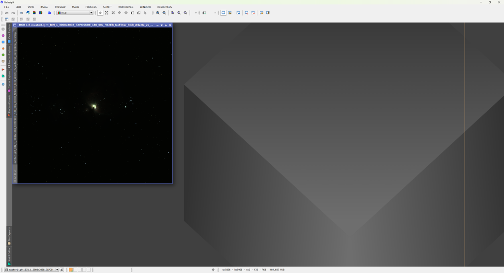
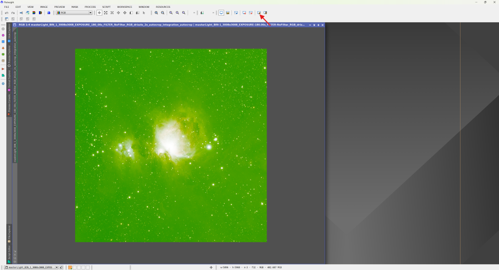
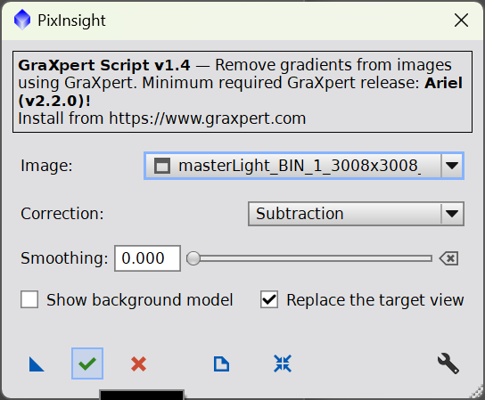

Teď konečně otevřeme složený snímek z minulého dílu. Klikněte na File → Open, najděte adresář s výsledky WBPP a otevřete soubor *masterLight…_integration_drizzle_autocrop.xisf*, jak jsme si řekli na konci [předchozího dílu](https://clearskies.cz/2024/06/24/pixinsight-pro-uplne-zacatecniky-3-stackovani-wbpp/ "PixInsight pro úplné začátečníky #3 – stackování WBPP").

Otevřou se dvě okna. Jedno z nich (nejspíš v popředí) je maska použitá pro autocrop – v názvu má „…mask“. To můžete bez obav zavřít. Zůstane vám výsledný složený snímek.

Na první pohled nic moc, že? Nevadí – pustíme se do toho. Okno si přizpůsobte velikostí monitoru a obrázek přibližte kolečkem myši, aby byl co největší. V horní liště klikněte na ikonku monitoru se symbolem „radioaktivity“. Pokud ji nevidíte, otevřete Process → ScreenTransferFunction. Po kliknutí se okamžitě změní zobrazení.

PixInsight teď pouze pro zobrazení upravil histogram – data se nijak nezměnila. Funkce se jmenuje STF AutoStretch. Obrázek je znatelně zelený, protože barevné kamery zaznamenávají zhruba 2× více zelené než ostatních barev. Není to problém – stačí znovu kliknout s drženým **Ctrl** a AutoStretch vyrovná barevné kanály. K původnímu vzhledu se vrátíte podržením **Shift** a kliknutím.

Lepší, že? AutoStretch zrušíte kliknutím na ikonku monitoru s křížkem, která je o dvě tlačítka vedle AutoStretch. Připomínám: změna je pouze vizuální. Kdybyste snímek teď uložili, vypadal by jako na úplně prvním obrázku.

## Extrakce pozadí

Na první pohled je vidět, že pravá horní část obrázku je světlejší než levá spodní. Jde o tzv. gradienty – způsobuje je světelné znečištění, vzdálená města nebo třeba sousedova žárovka. Gradienty chceme odstranit a máme více možností. Tradiční cestou jsou DynamicBackgroundExtraction nebo AutomaticBackgroundExtraction. Daleko rychlejší a často i s lepším výsledkem je ale GraXpert, který jsme instalovali v [prvním dílu](./01-01-instalace.md).

### GraXpert

Pokud jste instalovali doplňky podle [prvního dílu](./01-01-instalace.md)"PixInsight pro úplné začátečníky #1 – Instalace PixInsight, příprava prostředí"), otevřete Scripts → Toolbox → GraXpert.

Není potřeba nic nastavovat, stačí stisknout zelenou fajfku ✔️. Pokud by nastal problém, zkontrolujte v nastavení (vpravo dole), že je správně zadaná cesta k instalaci GraXpertu.

Výsledek je srovnatelný, ale zabere to pár sekund.

Dobrá práce!
