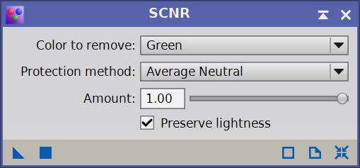

*Cílem této série návodů je provést začátečníka zpracováním DSO fotografií v programu PixInsight. Neočekává se od vás žádná znalost prostředí programu, ale zároveň by čtenář měl mít už nějaké povědomí o kalibračních snímcích, principu „stackování apod. Mým cílem je ukázat, že hezký (nikoliv dokonalý) snímek lze zpracovat v pár krocích s maximálním využitím toho, co PixInsight a různé jeho doplňky nabízí. Ukázková data (M42 – light frames, kalibrační snímky a nastackovaný snímek), která budou tuto sérii provázet jsou k dispozici ke stažení [zde](https://mega.nz/file/TYJXFIrJ#G6RTYuLBZxfHNJGWx-znRU1B8f1oh1rEwyQ8NnqSr4k). V průběhu návodů používám skripty a moduly třetích stran, návod na stažení všech je k dispozici v prvním dílu [zde](https://clearskies.cz/2024/04/29/1-instalace-pixinsight-priprava-prostredi/). Návody jsou tvořeny pro verzi PixInsight 1.8.9-3*

##### SPCC

Nyní se pustíme do kalibrace barev, využijeme proces SPCC. SPCC (Spectrophotometric Color Calibration) v PixInsight slouží k precizní kalibraci barev astronomických snímků na základě fotometrických dat hvězd. Spustíme ho přes záložku Process => ColorCalibration => SpectrophotometricColorCalibration

Důležité jsou pro nás políčka Red, Green a Blue Filter. V rozbalovací nabídce vyberete druh vašeho senzoru a použitý filtr. Já fotil přes ZWO ASI533MC Pro s UV/IR cut filtrem, tato kamera používá Sony senzor, tedy výběr je přesný. Pokud jste použili nějaký filtr proti světelnému znečištění nebo nějaký úzkopásmový, dost možná v nabídce je na výběr a pokud není, lze ho přidat ručně, návod na to najdete někdy v budoucnu třeba na těchto stránkách. Klidně můžeme odškrtnout políčko Generate graphs, není to podstatné, poté stačí trojúhelníček z levého dolního rohu přesunou do obrázku a dojde ke kalibraci barev. 

Pokud proces selže na hlášce „image does not have an astrometric solution“, není váš soubor se snímkem „plate-solved“ zkrátka neobsahuje astrometrická data o hvězdách v něm. WBPP toto standardně dělá, ale mohlo se to nepovést.   
Nejde však o vážný problém, stačí otevřít záložku Scripts => ImageAnalysis => ImageSolver. 

Přes tlačítko Search, vyhledejte objekt, který je na snímku – tím se vám doplní souřadnice, poté správně vyplňte datum, Focal distance (ohniskovou vzdálenost dalekohledu) a Pixel size. Všimněte si, že Pixel size je v mém případě 1.88px, to je tím, že na obrázek byl aplikován Drizzle x2, který 2x zmenšil velikost pixelů, jinak je velikost u mé kamery 3,76 mikrometru. Poté stačí kliknout na OK, dojde k astrometrické analýze snímku a můžete znovu spustit SPCC, už by neměl nastat žádný problém. 

Po aplikaci SPCC opět znovu proveďte Auto Stretch (buď se shift nebo ctrl, dle toho v jaké variantě obrázek vypadá přirozeněji) a nejspíš hned uvidíte rozdíl. 

##### SCNR

SCNR (Subtractive Chromatic Noise Reduction) je nástroj v PixInsight, který se používá k odstranění nežádoucích barevných šumů z astronomických snímků. Nejčastěji zeleného šumu, který je způsoben Bayerovou maskou u barevných kamer. 

Kolem SCNR panuje jistá kontroverze a spousta uživatelů zastává názor, že spíše obrázku škodí a kazí detaily. Já jsem toho názoru, že pokud je kalibrovaný obrázek stále viditelně zelený, tak bych SCNR použil a pohrál si s jeho intenzitou. Pokud je snímek jen maličko či vůbec není barevně nevyvážený, nepoužíval bych ho. V mém případě přebytečnou zelenou nevidím a nepovažuji za nutné SCNR použít, pouze vám ho ukážu. 

Otevřeme záložku Process => NoiseReduction => SCNR

Výchozí nastavení je správné, zkuste si ho aplikovat (opět přetáhnutím trojúhelníku vlevo dole do prostoru obrázku), poté vrátit zpátky a změnit Amount třeba o čtvrtinu nebo polovinu. A sami vizuálně posuďte zda se vám obrázek zdá spíše lepší nebo horší 🙂 

A to je pro tento díl vše. Příští díl bude dobrovolně-bonusový, budeme používat BlurXterminator k zostření (dekonvoluci) obrázku. Nemáte-li BlurXterminator koupený nebo aktivní trial, klidně přeskočte dál. Není to tak podstatné 🙂
