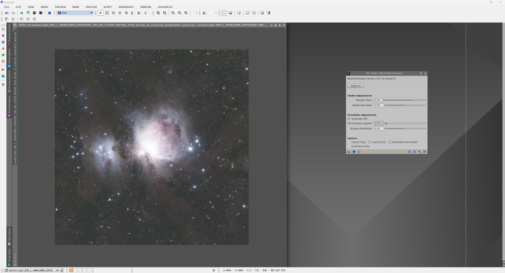

Krok s BlurXterminatorem je čistě volitelný. Jde o placený modul se zkušební verzí na 30 dní. V prvním díle jsem zmiňoval, že lze Starnet2 výrazně urychlit pomocí GPU s podporou CUDA. Pokud jste to nastavili, bude BlurXterminator také výrazně rychlejší.

BlurXterminator analyzuje rozmazání obrazu pomocí matematického modelu (Point Spread Function – popis toho, jak se světlo z bodového zdroje, např. hvězdy, šíří a rozmazává při průchodu optikou a atmosférou). Poté pomocí dekonvolučního algoritmu tento efekt „vrací“, čímž obnovuje detaily a ostrost. Zároveň používá AI modely trénované na jiných snímcích pro přesnější vyhodnocení.

BlurXterminator otevřete přes Process → All processes → BlurXterminator.

Nastavení můžete ponechat výchozí a proces rovnou aplikovat (přetažením trojúhelníku z levého dolního rohu do obrázku). S parametry si ale klidně pohrát můžete. V nastavení je vidět, že proces pomáhá i při přehnaně velkých hvězdách nebo halo okolo nich, například kvůli vysoké oblačnosti.

Výsledný obrázek vypadá následovně:

Podívejme se na srovnání celého snímku a detailů prachových mračen uprostřed mlhoviny. Vlevo je „před“, vpravo „po“.

Rozdíl je patrný na první pohled a zároveň nevznikají výrazné artefakty.

A můžeme pokračovat dál!
