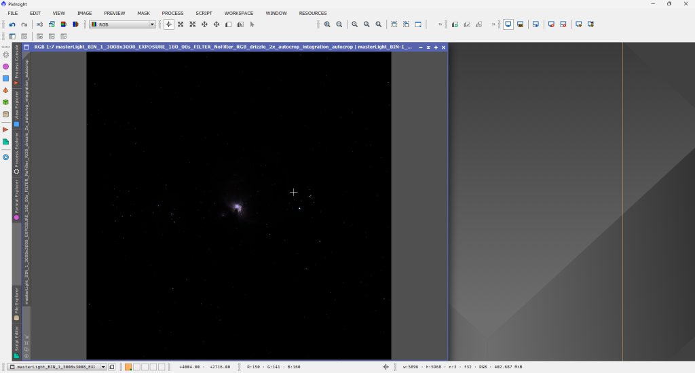

Až doposud jsme pracovali v tzv. lineární fázi zpracování, to znamená, že data jsou v surové podobě, kde světelnost pixelů přímo odpovídá množství přijatého světla. Neprovedli jsme žádnou změnu histogramu. Po zrušení Auto Stretch vypadá obrázek stále takhle:

Teď už začneme manipulovat s histogramem. Dostat data do nějaké viditelnější podoby lze mnoho způsoby, PixInsight má vestavěných hned několik procesů, velmi populární je modul třetí srany [GHS](https://ghsastro.co.uk). Nejedná se ale o triviální postup tedy přesahuje rámec této série. Použijeme skript Soft Stretch z EZ Processing suite, které jsme jako jeden z repozitářů instalovali v prvním dílu. 

##### Soft Stretch

Rovnou skript otevřeme ze záložky Scripts => EZ Processing suite => EZ Soft Stretch 

Můžete si zkusit trochu pohrát „šoupátky“ v otevřeném okně, ale já většinou použiju výchozí hodnoty a doladím poté ručně, což si ukážeme v dalších dílech. Stačí tedy kliknout na Run EZ Soft Stretch. 

Výsledek není na první pohled špatný.

Máme stále velmi přepálený střed a detaily temných mlhovin se nám trochu ztrácejí, to vyřešíme v následujícím díle, kde si začneme hrát s histogramem.
