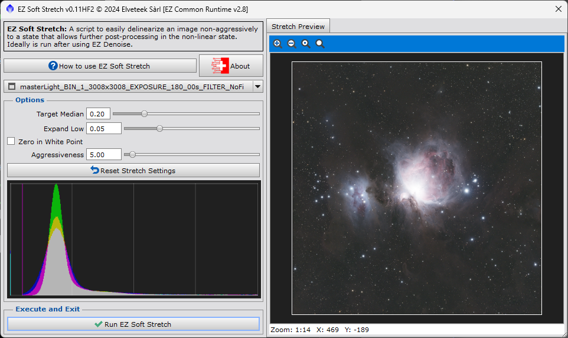

Až doposud jsme pracovali v tzv. lineární fázi, kdy jas pixelů odpovídá množství zachyceného světla. Histogram jsme neměnili. Po zrušení AutoStretch vypadá obrázek stále takto:

Teď začneme pracovat s histogramem. Do viditelnější podoby lze data převést více způsoby – PixInsight má několik vestavěných procesů a často se používá i modul třetí strany [GHS](https://ghsastro.co.uk). Ten je ale složitější a přesahuje rámec této série.

Použijeme skript Soft Stretch z balíku EZ Processing Suite, který jsme instalovali v prvním dílu.

## Soft Stretch

Skript otevřete přes Scripts → EZ Processing Suite → EZ Soft Stretch.

Můžete si pohrát se „šoupátky“, ale já většinou nechávám výchozí hodnoty a doladění řeším ručně v dalších krocích. Klikněte na Run EZ Soft Stretch.

Výsledek nevypadá špatně.

Střed je stále přepálený a detaily temných mlhovin se ztrácí. To vyřešíme v následujícím díle při práci s histogramem.
