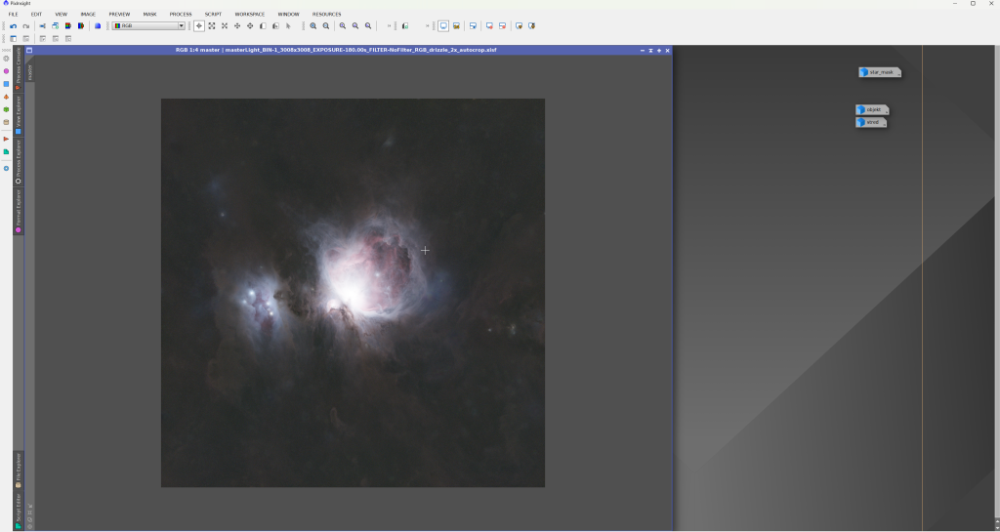

Než se pustíme do úprav, oddělíme obrázek objektu od hvězd. Budeme tak moci pracovat s mlhovinou a přitom si nepoškodit hvězdy. Ještě předtím si obrázek přejmenujeme. Klikněte pravým tlačítkem do okna obrázku na levé záložce s názvem.

Poté vyberte Identifier… a pojmenujte si obrázek, například „master“.

## StarNet2

Otevřete Process → <All processes> → StarNet2.

Jak jsme si řekli dříve, nejsme už v lineární fázi (to, co vidíme, je skutečná reprezentace obrazu). Proto **Linear data** nechceme mít zaškrtnuté. Naopak **Create starmask** zaškrtnout chceme.

Po aplikaci procesu se z obrázku odstraní hvězdy a vznikne druhý obrázek, který obsahuje pouze hvězdy. Nic dalšího nastavovat není potřeba – proces aplikujte klasicky přetažením trojúhelníku do obrázku.

Výsledek by měl vypadat takto:

Okno s hvězdami si můžete minimalizovat, nějakou dobu ho nebudeme potřebovat.

## Masky

Masky jsou běžný nástroj v úpravě obrázků – umožňují izolovat část snímku a upravovat jen ji. Maska může vycházet z barvy, jasu nebo jiné vlastnosti. Pro nás bude klíčový právě jas.

Často si vystačím s jednou maskou, která izoluje objekt od pozadí. V tomto snímku je ale střed výrazně přepálený, takže uděláme masku pro jasný střed a druhou pro celý objekt.

## RangeSelection

Pro vytvoření masek použijeme proces RangeSelection: Process → <All processes> → RangeSelection.

Poprvé použijeme Preview. Klikněte na třetí ikonu zleva v levém dolním rohu (prázdné kolečko). Zobrazí se bílé okno – to je v pořádku.

Teď vybereme pouze jasný střed. Posouvejte **Lower limit**, dokud Preview nevypadá zhruba takto:

Cílem je vybrat opravdu jen střed. Potom posuňte **Smoothness** zhruba na 1/3 až 1/2, aby byl přechod plynulý. U vašeho snímku se hodnoty mohou lišit – experimentujte.

Až budete s Preview spokojeni, klikněte na druhou ikonu dole vlevo (plný modrý čtverec). Vznikne okno s maskou (výchozí název „range_mask“). Přejmenujte ji třeba na „stred“ a minimalizujte.

RangeSelection ještě nezavírejte. Klikněte na ikonu v **pravém** dolním rohu, čímž resetujete parametry, a znovu otevřete Preview nad obrázkem objektu.

Preview bude opět bílé. Nyní chceme vytvořit masku celého objektu, ideálně i s temnými mlhovinami. Zkuste si posouvat šoupátka sami. Můžete použít i **Upper limit** a vyjmout jasný střed, abychom s ním později zbytečně nemanipulovali. Referenční výsledek může vypadat takto:

Opět vytvořte masku, pojmenujte ji třeba „objekt“ a nástroj RangeSelection můžete zavřít.

Pracovní plocha PixInsightu by měla vypadat zhruba takto:

Máme obrázek objektu, obrázek s hvězdami (star_mask) a dvě masky objektu. Teď se můžeme pustit do dalšího zpracování.
