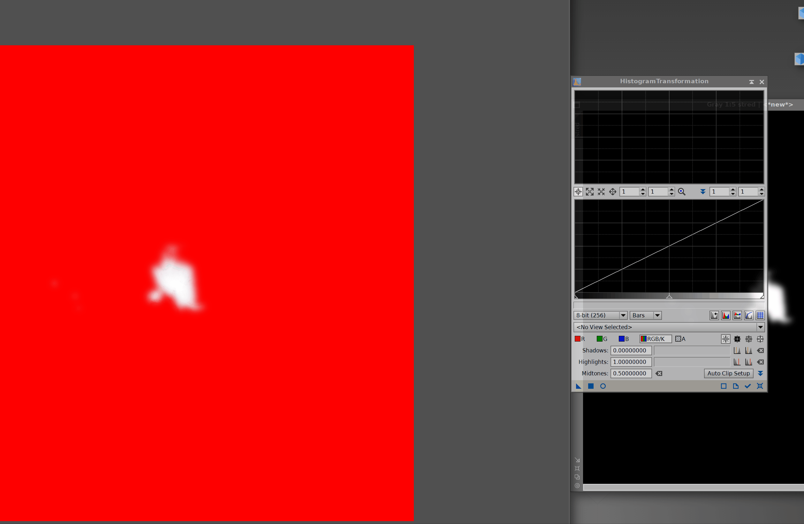

*Cílem této série návodů je provést začátečníka zpracováním DSO fotografií v programu PixInsight. Neočekává se od vás žádná znalost prostředí programu, ale zároveň by čtenář měl mít už nějaké povědomí o kalibračních snímcích, principu „stackování apod. Mým cílem je ukázat, že hezký (nikoliv dokonalý) snímek lze zpracovat v pár krocích s maximálním využitím toho, co PixInsight a různé jeho doplňky nabízí. Ukázková data (M42 – light frames, kalibrační snímky a nastackovaný snímek), která budou tuto sérii provázet jsou k dispozici ke stažení [zde](https://mega.nz/file/TYJXFIrJ#G6RTYuLBZxfHNJGWx-znRU1B8f1oh1rEwyQ8NnqSr4k). V průběhu návodů používám skripty a moduly třetích stran, návod na stažení všech je k dispozici v prvním dílu [zde](https://clearskies.cz/2024/04/29/1-instalace-pixinsight-priprava-prostredi/). Návody jsou tvořeny pro verzi PixInsight 1.8.9-3*

Nyní bude naším cílem snížit jas přepáleného středu mlhoviny a naopak trochu vytáhnout jas na okrajích. Pokud editujete vlastní obrázek a neřešíte přepálený střed, můžete přeskočit až na část, kdy budeme aplikovat masku celého objektu. 

## Střed

Prvně se pověnujeme středu. Vytvořenou masku z minulého dílu bude potřeba přetáhnutím aplikovat na náš obrázek. 

Aplikujte masku dle animace výše, je potřeba přetáhnout záložku z levého okraje okna masky do levého okraje okna obrázku, přesně tak jak je to v animaci. Poté otevřeme Process => <All processes> => HistogramTransformation. V okně vybereme náš obrázek, poté klikneme do prostoru obrázku a otevřeme preview kolečkem v levém dolním rohu, tak jako v minulém díle. 

Preview je velmi užitečné, jelikož na našem master obrázku máme aplikovanou masku, vše co není vybrané maskou je červené, zatímco v preview vidíme jakoukoliv změnu, co uděláme v histogramu ještě než ji opravdu aplikujeme na náš obrázek. Aplikace se provádí modrým čtverečkem v levém horním rohu okna histogram transformation hned vedle tlačítka pro preview. 

Jelikož chceme vybranou oblast ztmavovat, budeme histogram posouvat doprava. Doporučuji vždy posunout o malý kousek, kouknout je na preview, poté aplikovat, vyresetovat okno HistogramTransformation (tlačítko čtyř šipek vpravo úplně dole) a opět posunout o malý kousek, dokud nebudeme s výsledkem spokojeni. V histogramu manipulujeme s levou a prostřední šipkou a posouváme je doprava. 

V obrázku jsou čtyři vyznačené šipky, v prvním řádku pohyb histogramem, poté aplikovat a poté vyresetovat, opakujte, dokud nebudete spokojení. Můžete si povšimnout, že se nám příliš ztmavuje okolí středu a střed je pořád přepálený viz obrázek níže.

Bohužel, nám nebude stačit jedna maska na střed. Nyní tedy zavřeme preview okno, zavřeme HistogramTransformation, zrušíme a smažeme masku pro střed. 

Nyní je na vás, abyste stejně jako v minulém dílu vytvořili pro střed ještě jednu (menší) masku znovu si ji aplikovali a pomocí HistogramTransformation opět ztmavili trochu menší oblast. Klidně tenhle postup s vytvářením menší masky opakujte třikrát, čtyřikrát, dokud nebudete s jasem středu spokojení. Bohužel úplně střed zachránit nepůjde (příliš dlouhé expozice při focení) a uspokojivý výsledek by mohl vypadat nějak takto. 

## Objekt

Nyní aplikujeme masku objektu stejným způsobem. Opět otevřeme histogram transformation a budeme šetrně histogramem hýbat na druhou stranu. Opět po malých krůčcích vždy aplikovat a kontrolovat výsledek, objekt je jasný dost, není potřeba dělat velké změny. Zarážku úplně vlevo posuneme doprava zhruba do míst, kde histogram začíná a druhé dvě zarážky jemně posouváme směrem doleva. 

Několik jemných pohybů bude stačit k mírnému zlepšení a více se do toho raději pouštět nebudeme. Masku si ale nechme ještě aplikovanou. Klikneme na záložku Mask => Invert mask. 

Tím vymaskujeme přesný opak toho co doposud a provedeme to samé, co se středem, tedy budeme přes HistogramTransformation ztmavovat, pomůže nám to trochu zvýšit kontrast objektu a pozadí, ale opět stačí jen pár velmi jemných pohybů! Výsledek by mohl vypadat nějak takto. 

Masku ještě neodstraňujme, proveďte znovu Invert mask, tak aby se vrátil původní výběr a příště si trochu pohrajeme s barvami.
