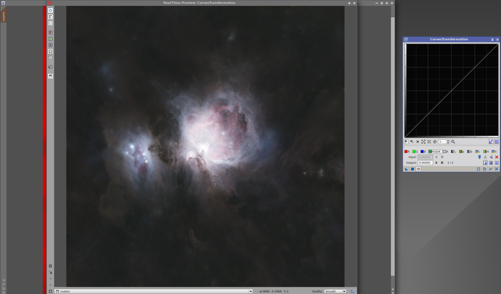
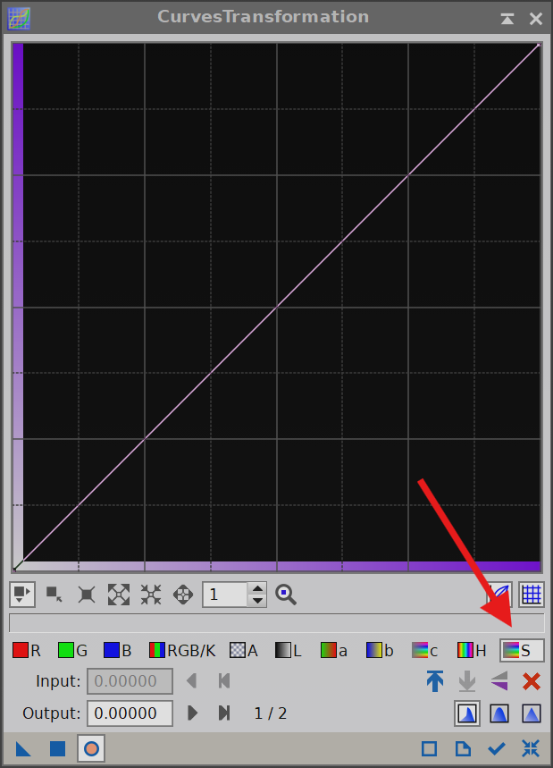
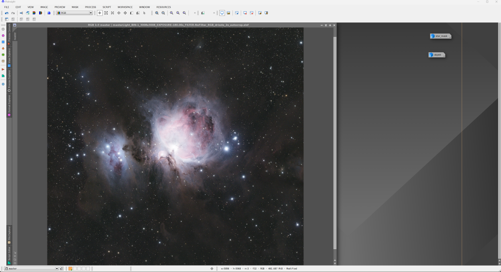

Jas máme upravený, teď s maskou objektu otevřeme Process → <All processes> → CurvesTransformation.

Opět otevřeme Preview, aby okno CurvesTransformation a náhled byly vedle sebe.

Pokud máte nevyvážené barvy, klikněte na kanály R, G a B a jemně hýbejte křivkou nahoru či dolů. Postupujte po malých krocích: vždy aplikovat, resetovat a zkontrolovat, jak snímek vypadá.

Pokud barvy sedí, obvykle upravuji hlavně saturaci (ikona s písmenem **S** úplně vpravo).

Zkuste křivku ve středu párkrát jemně zvednout a sledujte změny.

Jakmile budete spokojeni, CurvesTransformation zavřete, masku z obrázku odstraňte a podívejte se na výsledek.

Teď je čas vrátit do snímku hvězdy, které máme uložené v okně `star_mask`. Použijeme proces PixelMath (Process → All processes → PixelMath). PixelMath je extrémně užitečný nástroj – umí například přehazovat barevné kanály (SHO palety) a spoustu dalšího. My ho použijeme pouze na „sečtení“ objektu a hvězd.

Do textového pole napište názvy obrázků, mezi ně znak `+`, a aplikujte čtverečkem v levém dolním rohu.

Jako malý bonus lze ještě použít skript pro zvýraznění tmavých mlhovin (pokud se v obrázku vyskytují). Najdete ho v Script → Utilities → DarkStructureEnhance.

Nastavení klidně nechte výchozí a klikněte na OK. Můžete si ale vyzkoušet i jiné hodnoty – vždy se dá vrátit zpět. Výsledek po aplikaci je níže.

