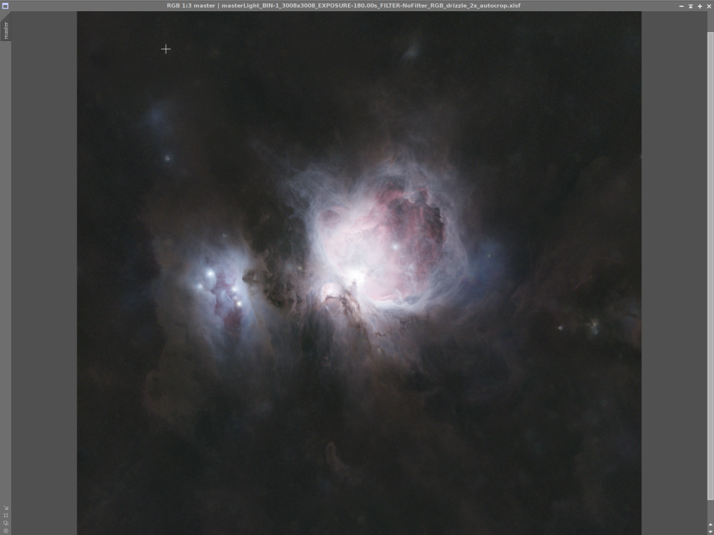

Teď bude naším cílem ztlumit přepálený střed mlhoviny a naopak jemně vytáhnout jas na okrajích. Pokud upravujete vlastní snímek a přepálený střed neřešíte, můžete přeskočit rovnou na část, kde aplikujeme masku celého objektu.

## Střed

Nejprve se zaměříme na střed. Masku vytvořenou v minulém dílu přetáhněte na náš obrázek.

Masku aplikujte tak, jak je vidět v animaci – přetáhněte záložku z levého okraje okna masky na levý okraj okna obrázku.

Poté otevřete Process → <All processes> → HistogramTransformation. V okně vyberte náš obrázek, klikněte do jeho prostoru a otevřete Preview kolečkem v levém dolním rohu (stejně jako minule).

Preview je velmi užitečné: na hlavním obrázku je maska zobrazená červeně, ale v Preview vidíte reálný náhled změn dřív, než je aplikujete. Aplikace probíhá kliknutím na modrý čtvereček v levém horním rohu okna HistogramTransformation.

Protože chceme vybranou oblast ztmavit, posuneme histogram doprava. Doporučuji malé kroky: posunout, podívat se na Preview, aplikovat, vyresetovat HistogramTransformation (tlačítko čtyř šipek vpravo dole) a zopakovat. Posouváme levou a prostřední šipku doprava.

Na obrázku jsou vyznačené čtyři kroky: posun histogramu, aplikace a reset. Opakujte, dokud nebudete spokojeni. Můžete si všimnout, že se okolí středu ztmavuje, ale samotný střed je stále přepálený.

Bohužel v tomto případě jedna maska nebude stačit. Zavřete Preview, zavřete HistogramTransformation, zrušte a smažte masku pro střed.

Teď si vytvořte menší masku (stejně jako v minulém díle), znovu ji aplikujte a přes HistogramTransformation ztmavte ještě menší oblast. Tento postup klidně zopakujte třikrát nebo čtyřikrát, dokud nebudete s jasem středu spokojení. Úplně střed ale v tomto případě zahcránit nepůjde, kvůli dlouhým expozicím, dynamickému rozsahu kamery apod. 

## Objekt

Teď aplikujeme masku objektu stejným způsobem. Otevřeme HistogramTransformation a tentokrát budeme histogram jemně posouvat opačným směrem. Opět postupujte po malých krůčcích a vždy kontrolujte Preview.

Zarážku úplně vlevo posuňte doprava tam, kde histogram začíná, a další dvě zarážky jemně posouvejte doleva.

Několik jemných pohybů stačí ke zlepšení. Masku zatím ponechte. Klikněte na Mask → Invert mask.

Tím vyberete opačnou oblast a postup zopakujte: histogramem jemně ztmavujte. Pomůže to zvýšit kontrast mezi objektem a pozadím – ale opět stačí jen pár velmi jemných kroků. Výsledek může vypadat zhruba takto:

Masku zatím neodstraňujte. Ještě jednou použijte Invert mask, abyste měli zpět výběr objektu. V příštím díle si pohrajeme s barvami.
