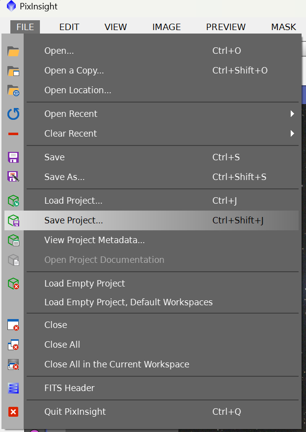
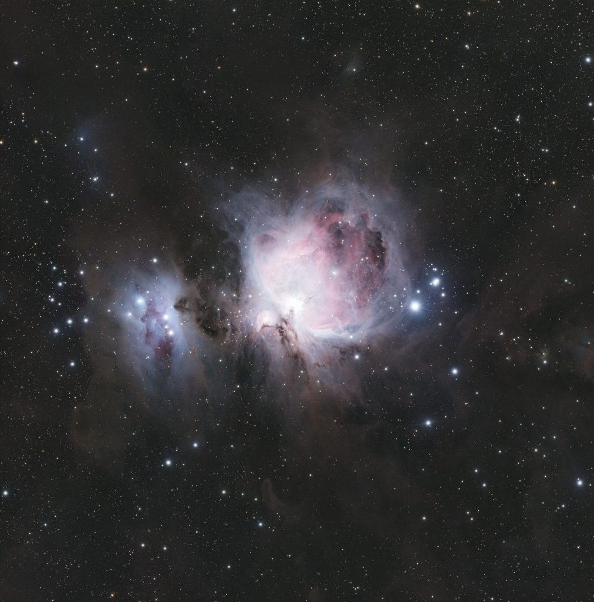

Se zpracováním jsme hotovi. Jak uvádím v úvodu každého dílu, výsledek nemusí být dokonalý – každý objekt vyžaduje trochu jiné úpravy. Mým cílem bylo předat základní workflow, které je společné pro většinu typů astrofotek. Doufám, že se vám zpracování podařilo a hlavně, že vás celý proces bavil. Protože nejen focení, ale i zpracování by měla být zábava. 🙂

Pokud si chcete uložit projekt a někdy se k němu vrátit, použijte File → Save Project. Později ho otevřete přes File → Load Project.

Pokud chcete uložit pouze hotový obrázek, použijte Save As a vyberte formát – mně teď stačí třeba JPG.

A teď výsledný snímek…

